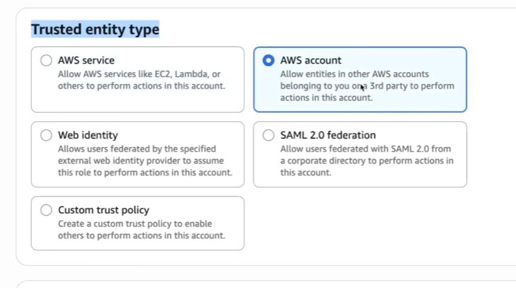

# AWS FREE TIER ACCOUNT

Inicie com a conta free tier, alguns serviços serão disponíveis apenas 12 meses

## Principais erro ao usar AWS

❌ Ignorar Alertas de Cobrança
👉 Risco de cobranças acidentais. Sempre configure um orçamento de custos com alertas por e-mail.

❌ Usar Instâncias EC2 ou RDS Grandes
👉 Utilize apenas tipos t2.micro ou outros elegíveis ao Free Tier.

❌ Implantar Usando o Usuário Root
👉 Crie um usuário IAM para as atividades do dia a dia com permissões limitadas.

❌ Esquecer de Parar/Encerrar Recursos
👉 EC2, RDS e até volumes EBS podem gerar cobranças se permanecerem em execução.

❌ Armazenar Arquivos Grandes no S3 sem Limpeza
👉 O Free Tier inclui 5 GB — monitore regularmente o uso do S3.

❌ Não Receber o E-mail de Ativação
👉 Sua conta não estará pronta até que você receba a confirmação da AWS.

❌ Escolher um Plano de Suporte Pago
👉 Selecione Suporte Básico ( Gratuito ) durante o cadastro.

❌ Não Monitorar o Uso
👉 Utilize o Painel de Cobrança ( Billing Dashboard ) para acompanhar o consumo mensal.

## BUDGETS

Sempre adicione orçamento de custos > Para isso pesquise "Billing" no painel da AWS > No painel Billing e costs home > Budgets, selecione:

    - Use a template ( simplified )
    - Coloque o nome do template
    - Coloque os emails das pessoas que irão receber
    - Clique em criar o budget

Ao passar do limite será enviado uma mensagem para o email do custo já atingido

# TIPOS DE USUÁRIOS

`Root User:` Pode criar usuários, apagar arquivos do sistema, instalar serviços e modificar qualquer configuração. Deve inserir um Email na criação.

`IAM User:` usuários criados para uso diário, com permissões específicas e mais seguras. Deve inserir email.

Por padrão, uma conta AWS permite até 5.000 usuários IAM. Esse limite pode ser consultado e, em alguns casos, solicitado para aumento através do Service Quotas.

Para criar um novo usuário: 

    - Acesse IAM resources
    - Na aba esquerda Acess Management > Users > Create user coloque:
        - Coloque um nome
        - Caso o usuário necessite de acesso ao console marque para ele ter permissão ao console da AWS, caso seja uma API não marque essa opção, pois irá ser usado Access Keys (Access Key ID e Secret Access Key) para API's
        - Caso deseja controlar mais específicamente o usuário marque o serviço Identity Center
        - Pode gerar uma senha ou customizar a senha
        - Caso deseje que o usuário mude a senha marque a opção de troca de senha

    - No Painel de Permissões( Set Permissions )
        Tem as seguintes opções Add Group, Copy permissions ou Attach policies directly 
    - Clique em create user
    - Irá ser criado o link da conta AWS criada o nome e a senha do usuário

Um usuário que não tem acesso a um serviço irá ser demonstrado como "API Error"
A lista de usuários estará em IAM > Users

## Policies ( Políticas de acesso )

Um usuário pode ou não ter acesso a um serviço para adicionar o acesso a um serviço para um usuário:

    - Vá IAM > Users > Clique no nome do usuário > Add Permission > Attach policies directly > Adicione as políticas necessárias.
    - Políticas terminadas em FullAccess permite o controle total do serviço pelo usuário, portanto AmazonEC2FullAcess permite o controle total do serviço EC2 

## User Groups

Configuração de política para alguns usuários que podem ser criados.
Para criar um grupo de usuário:

    - IAM > User groups > Create group > Dê um nome para o grupod de usuários > Dê acessos as políticas > Clique em Create Group 

## IAM Role

São permissões de acesso temporário para um um usuário ou qualquer outro aplicativo. Cada IAM Role terá um tipo de permissão.

Para criar um IAM ROLE:
    
    1. IAM > Roles > Create Role
    2. Selecione o tipo de entidade confiável, tipos de entidades, abaixo segue os tipos de entidades
    3. Adicione as permissões necessárias
    4. Dê um nome para a Role
    5. Adicione a Role para uma pessoa, para isso faça:
        5.1. IAM > Users > Selecione o usuário > Add Permissions > Create inline policy
        5.2 Edite com JSON
            "Action": Coloque em Action a ação que pode ser: pode ser "sts:AssumeRole",
             "Resource": Coloque o ARN da ROLE
        5.3 Salve e dê um nome para a policy
    6. Para acessar a Role ( assumir a Role ), vá em IAM > Roles > Abra o link em "Link to switch roles in console"
    

# Entidades confiáveis

### AWS service
É a opção mais utilizada.
Permite que um serviço da própria AWS utilize essa Role para executar ações em seu nome.
Por exemplo EC2 acessar um bucket S3.

### AWS account
Essa opção permite que outra conta AWS utilize essa Role.

### Web identity
Permite que usuários autenticados por um provedor de identidade web assumam uma Role.

### SAML 2.0 federation
Usado por empresas que possuem um sistema corporativo de autenticação.

### Custom trust policy
Permite escrever manualmente a política de confiança.

---
# Serviços
---

# Como gerar o Acess Key para uma aplicação acessar um serviço

    1. Vá em IAM > Users
    3. Selecione ou crie o usuário( o usúário deve ser um IAM user )
    4. Dê acesso ao serviço desejado( Por exemplo ele pode ter a permissão AWSS3FullAcess )
    5. No menu de informações do usuário clique em Create Acess Key
        5.1. Selecione o caso de uso
        5.2. Caso seja necessário adicione uma tag a acess key
        5.3. Será gerado um valor para "Acess key" e "Secret acess key"

## Serviço Simple Storage Service - S3

Utilizado para salvar objetos, para isso crie um novo bucket( balde ) ele irá armazenar objetos
    Buckets: como se fosse uma pasta, como um container
    Object: qualquer arquivo, que pode ser armazenado também em pastas e em sub-pastas
    Key: Nome único do arquivo, que pode estar em pastas
    Region: região da AWS específica
    Public Acess: controla quem pode acessar o bucket ou o arquivo

Para criar um bucket:

    - Acesse Amazon S3 dentro do console da AWS
    - Escolha a região 
    - Escolha entre "General purpose" ( É o bucket tradicional do S3, utilizado na maioria dos projetos. ) ou "Directory" ( São voltados para aplicações que precisam de milhares ou milhões de operações por segundo. ) -
    - Dê um nome ao bucket, ele tem que ser único em toda a AWS
    - Em Object Ownership, escolha entre habilitar ou desabilitar ACLs, caso esteja desabilitado somente o proprietario da conta poderá definir o acesso ao bucket
    - Defina se deseja que o bucket seja público ou não 
    - Em Bucket Versioning escolha entre se deseja versionar os objetos ou não. Caso esteja desabilitado em caso de exclusão acidental não tem backup
    - Adicione tags para buckets, caso deseje, as tags podem ser utilizadas para segregar buckets
    - Selecione o tipo de criptografia para o bucket ( por padrão colocar SSE-S3 )
    - Caso o projeto necessite de controle de concorrência para os objetos, habilite "Object Lock", isso automaticamente irá habilitar o versionamento

Para acessar a lista de buckets:

    - Acesse Amazon S3 > General purpose buckets

Custos:
Custos:

    - S3 Standard: Ideal para arquivos acessados com frequência.
    - S3 Intelligent-Tiering: Indicado para padrões de acesso variados ou imprevisíveis, alternando automaticamente entre camadas de armazenamento para reduzir custos.
    - S3 Standard-IA: Recomendado para arquivos acessados ocasionalmente, mas que precisam de recuperação rápida.
    - S3 Glacier Instant Retrieval: Ideal para arquivamento de dados raramente acessados, com recuperação imediata.
    - S3 Glacier Flexible Retrieval: Indicado para arquivamento de longo prazo, quando a recuperação pode levar alguns minutos ou horas.
    - S3 Deep Archive: Melhor opção para arquivamento de longo prazo de dados quase nunca acessados, com o menor custo de armazenamento.

## Serviço Elastic Compute Cloud - EC2

